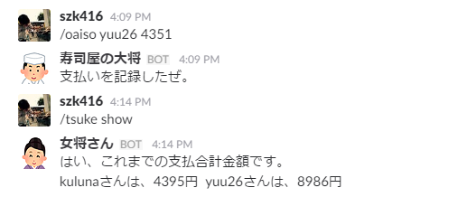

# Oaiso
===

Slackで寿司の支払いを記録・参照できます。
Record the payment of SUSHI by Slash commands of Slack.

# Functions
- 記録（Record）
- 参照（Reference）
- クリア（Clear）

# Setup
- [Setup(日本語)](docs/setup_ja.md) Under Construction...
- [Setup(English)](docs/setup_en.md) Under Construction...

# Contributing
1. Fork it!
1. Create your feature branch: `git checkout -b my-new-feature`
1. Commit your changes: `git commit -am 'Add some feature'`
1. Push to the branch: `git push origin my-new-feature`
1. Submit a pull request :D

# License
- MIT License.  
- Emoji used from [https://github.com/WebpageFX/emoji-cheat-sheet.com](https://github.com/WebpageFX/emoji-cheat-sheet.com)
